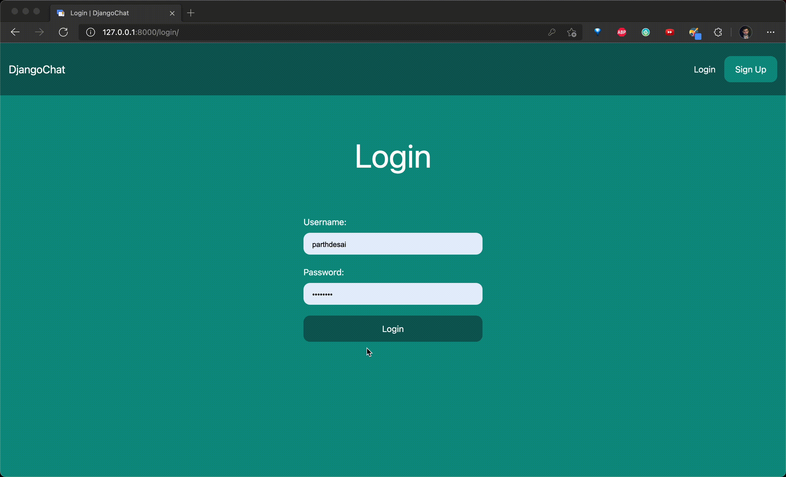

# Django ChatApp

A small real time chat application built using Django. It also uses Channels and Vanilla Javascript with Web Sockets.




## Architecture ##
 - When a user logs in, the frontend downloads the room list and opens a Websocket connection to the server.
 - When a user selects another user to chat, the frontend downloads the latest 25 messages (see [Line #13 in views.py](room/views.py)) they've exchanged.
 - When a user sends a message, the frontend sends a POST to the framework, then Django saves the message and will be displayed for every user.

## Scaling ##

> Because Channels takes Django into a multi-process model, you no longer run everything in one process along with a WSGI server (of course, you’re still free to do that if you don’t want to use Channels). Instead, you run one or more interface servers, and one or more worker servers, connected by that channel layer you configured earlier.

In this case, I'm using the In-Memory channel system, but could be changed to the Redis backend to improve performance.

Please take a look at this [link](https://channels.readthedocs.io/en/latest/introduction.html) below for more information.

### Database ###
For this demo, I'm using a simple SQLite setup.

## Future Work ##
Because of time constraints this project lacks of:

- User Selector Pagination
- Good Test Coverage
- Better Comments / Documentation Strings
- Frontend Tests
- Backend Tests
- Modern Frontend Framework (like React)
- Frontend Package (automatic lintin, building and minification)
- Proper UX / UI design (looks plain bootstrap)

## Run ##

1. Move to the project root folder.

2. Create and activate a virtual environment.
```bash
virtualenv env
source env/bin/activate
```
> (for mac)

To deactivate the environment
```bash
deactivate
```

3. Install requirements

```bash
pip3 install -r requirements.txt
```

4. Initialize database
```bash
python3 manage.py migrate
```

5. Create admin user
```bash
python3 manage.py createsuperuser
```

6. Run development server
```bash
python3 manage.py runserver
```

## Directory Layout

```bash
📦djangochat
 ┣ 📂core
 ┃ ┣ 📂static
 ┃ ┃ ┣ 📂images
 ┃ ┃ ┃ ┗ 📜favicon.ico
 ┃ ┣ 📂templates
 ┃ ┃ ┣ 📂core
 ┃ ┃ ┃ ┣ 📜base.html
 ┃ ┃ ┃ ┣ 📜frontpage.html
 ┃ ┃ ┃ ┣ 📜login.html
 ┃ ┃ ┃ ┗ 📜signup.html
 ┃ ┣ 📜admin.py
 ┃ ┣ 📜apps.py
 ┃ ┣ 📜forms.py
 ┃ ┣ 📜models.py
 ┃ ┣ 📜tests.py
 ┃ ┣ 📜urls.py
 ┃ ┗ 📜views.py
 ┣ 📂djangochat
 ┃ ┣ 📜asgi.py
 ┃ ┣ 📜settings.py
 ┃ ┣ 📜urls.py
 ┃ ┗ 📜wsgi.py
 ┣ 📂room
 ┃ ┣ 📂templates
 ┃ ┃ ┣ 📂room
 ┃ ┃ ┃ ┣ 📜room.html
 ┃ ┃ ┃ ┗ 📜rooms.html
 ┃ ┣ 📜admin.py
 ┃ ┣ 📜apps.py
 ┃ ┣ 📜consumers.py
 ┃ ┣ 📜models.py
 ┃ ┣ 📜routing.py
 ┃ ┣ 📜tests.py
 ┃ ┣ 📜urls.py
 ┃ ┗ 📜views.py
 ┣ 📜db.sqlite3
 ┣ 📜manage.py
 ```